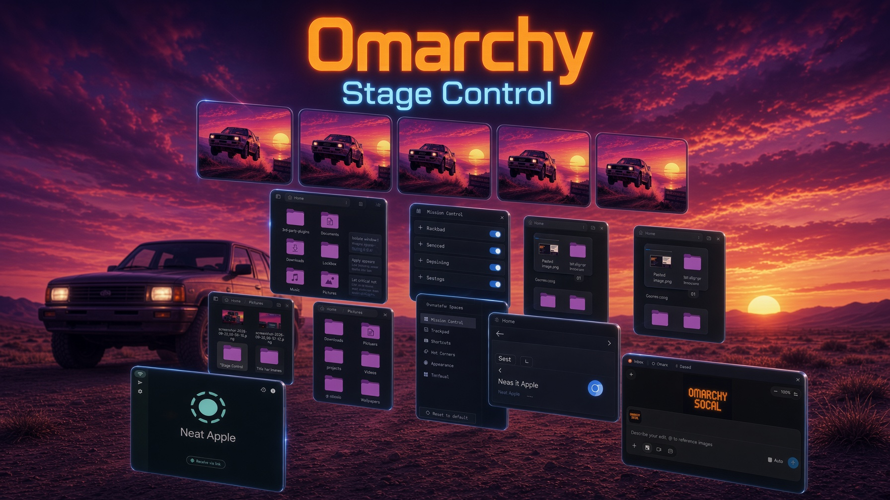
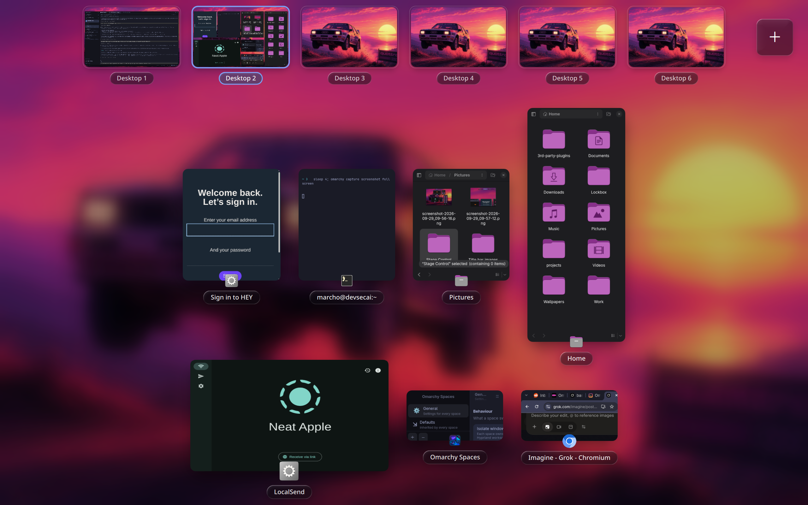
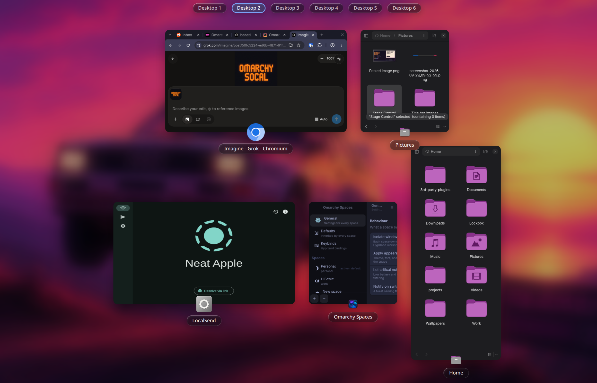
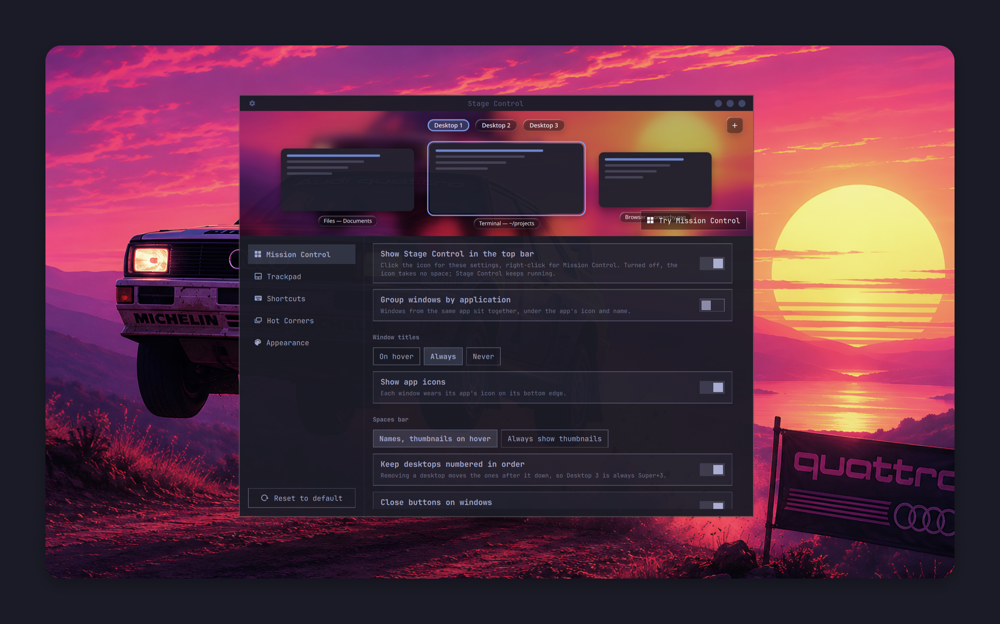

# Stage Control for Omarchy



macOS-style Mission Control for Omarchy. Swipe up with four fingers and every
window on your desktop spreads out with live previews, under a Spaces bar of
your desktops. Drag windows between desktops, add, remove and reorder
desktops, close windows, and swipe down for App Exposé.

* **Follows your fingers.** The swipe is tracked 1:1, like macOS: windows fly
  out of their places as you move, and letting go finishes or cancels by how
  far and how fast you swiped.
* **Live previews** of every window on your desktop, and live thumbnails of
  your other desktops in the Spaces bar.
* **Spaces bar.** Your desktops' names along the top; point at it (or drag a
  window toward it) and it opens into live thumbnails.
* **Organize desktops.** Drag a window onto a desktop to move it there, or onto
  **+** for a new desktop. Drag desktops to reorder them. Hover one and click
  **×** to remove it; its windows move to the desktop before it (after it, for
  the first one). Right-click one to rename it.
* **Close windows.** Hover a window and click its **×**, middle-click it, or
  pick it and press Ctrl+W.
* **App Exposé.** Swipe down to see every window of the app you're using, on
  any desktop, with windows minimized by
  [Title Bars](https://github.com/marcho78/omarchy-titlebars) in a row at the
  bottom.
* **Liquid Glass.** The Spaces bar, labels and buttons refract the wallpaper
  behind them, like macOS Tahoe. Or pick Frosted or Solid.
* **Hot corners**, Mac keyboard shortcuts (Ctrl+↑, Ctrl+↓, Ctrl+←/→ and the
  Mission Control key), and a settings window for gestures, shortcuts and looks.
* **An icon in the top bar:** click it for Stage Control's settings,
  right-click for Mission Control, middle-click for App Exposé.
* **Seamless.** When Mission Control opens it starts from an exact picture of
  your screen: title bars and borders ride along with their windows, and the
  bar slides away instead of blinking out.

## Screenshots

**Mission Control:** every window on the desktop, under live thumbnails of
your desktops.



**The Spaces bar at rest:** just your desktops' names, until you point at it
or drag a window toward it.



## Screenshots

**Mission Control with the Spaces bar open:** live thumbnails of every
desktop, which you can rename.


**The Spaces bar at rest:** the same desktops by name.


**Settings:** Mission Control, trackpad, shortcuts, hot corners and
appearance.




## Requirements

Omarchy 4 (Quattro), which brings everything Stage Control uses: the Omarchy
shell on Quickshell 0.3, and Hyprland 0.56 or newer with its Lua configuration
(the Lua gesture API is what lets Mission Control follow your fingers).
Nothing else to install. The swipe needs a touchpad: four fingers by default,
or three or five in the settings.

## Install

```bash
omarchy plugin add https://github.com/marcho78/omarchy-stage-control.git --enable
```

That's all: no setup step, nothing to build, and your Hyprland config is not
touched. Stage Control registers its gesture and shortcuts with Hyprland while
it runs and takes them back out when you disable it.

Enabling puts Stage Control's icon on the right of the bar; move it with
`omarchy bar move marcho78.stage-control --section left` (or `center`).
Omarchy keeps a plugin with a bar icon on for as long as the icon is in the
bar, so taking the icon out of the bar turns Stage Control off. To keep Stage
Control without the icon, turn off **Show Stage Control in the top bar** in its
settings: the icon then takes no space.

## Use

| To | Do |
|---|---|
| Open Mission Control | Swipe up with four fingers, press **Super+A**, or use a hot corner you've set up |
| See the app's windows (App Exposé) | Swipe down with four fingers, or press **Super+Alt+A** |
| Go to a window | Click it, or pick it with the arrow keys or Tab and press Return |
| Go to a desktop | Click it in the Spaces bar, or press 1–9 |
| Move a window to a desktop | Drag it onto the desktop in the Spaces bar |
| Put a window on a new desktop | Drag it onto **+** |
| Add a desktop | Click **+** in the Spaces bar |
| Remove a desktop | Hover it in the Spaces bar and click **×** |
| Reorder desktops | Drag a desktop sideways in the Spaces bar |
| Rename a desktop | Right-click it in the Spaces bar, type a name and press Return (Esc cancels; an empty name goes back to "Desktop 3") |
| Close a window | Hover it and click **×**, middle-click it, or pick it and press Ctrl+W |
| Switch desktops while open | Ctrl+← / Ctrl+→ |
| Leave | Esc, click the background, swipe back, or press the shortcut again |
| Settings | Click Stage Control's icon in the bar, right-click the background, or `omarchy-shell stage-control settings` |

Desktops are Hyprland workspaces: Desktop 3 is workspace 3, Super+3. Stage
Control keeps desktops you add even while they're empty, like macOS does.
Removing a desktop moves the desktops right after it down one, so the numbers
stay in order; desktops further out (like a workspace 9 your window rules use)
keep their numbers. Turn off **Keep desktops numbered in order** to keep every
number as it is. A desktop's name stays with its windows: reorder desktops or
remove one, and each name moves with the desktop it belongs to.

### From a terminal or your own bindings

```bash
omarchy-shell stage-control toggle            # Mission Control (show / hide: open or close only)
omarchy-shell stage-control expose            # the focused app's windows
omarchy-shell stage-control exposeApp firefox # any app's windows, by window class
omarchy-shell stage-control desktopNext       # next desktop (desktopPrevious: the one before)
omarchy-shell stage-control addDesktop        # on the focused display
omarchy-shell stage-control removeDesktop 3
omarchy-shell stage-control renameDesktop 3 "Web"  # "" goes back to Desktop 3
omarchy-shell stage-control moveWindow 0x55d4e2c1a0f0 2
omarchy-shell stage-control settings
omarchy-shell stage-control status
```

## Settings

Open them from Stage Control's icon in the bar, with a right-click in Mission
Control, or with `omarchy-shell stage-control settings`. They apply
immediately and are saved on Stage Control's entry in
`~/.config/omarchy/shell.json`, keeping only what differs from the defaults in
`Defaults.js`. That entry is also the one Omarchy removes when you disable
Stage Control or take its icon out of the bar, so your settings go with it.

| Setting | Default | Values |
|---|---|---|
| `barIcon` | `true` | show Stage Control's icon in the top bar |
| `gestureFingers` | `4` | `0` (off), `3`, `4`, `5` |
| `appExposeGesture` | `true` | swipe down for App Exposé |
| `desktopSwipeFingers` | `0` | `0` (off), `3`, `4`, `5`: swipe sideways between desktops |
| `shortcuts` | `true` | keyboard shortcuts on or off |
| `missionControlKey` | `SUPER + A` | any modifiers and a key, or empty |
| `appWindowsKey` | `SUPER + ALT + A` | any modifiers and a key, or empty |
| `macShortcuts` | `false` | Ctrl+↑, Ctrl+↓, Ctrl+←/→ and the Mission Control key (F3 on Mac keyboards) |
| `cornerTopLeft`, `cornerTopRight`, `cornerBottomLeft`, `cornerBottomRight` | `none` | `none`, `missionControl`, `appWindows`, `launchpad`, `menu`, `lock`, `screensaver` |
| `groupByApp` | `false` | group windows by application |
| `windowTitles` | `hover` | `hover`, `always` (on hover when grouped by app), `never` |
| `appIcons` | `true` | app icons on windows |
| `spacesBar` | `auto` | `auto` (names; thumbnails on hover), `expanded` |
| `renumberDesktops` | `true` | close the gap when a desktop is removed |
| `closeButtons` | `true` | a close button on the window under the pointer |
| `middleClickClose` | `true` | middle-click closes a window |
| `showMinimized` | `true` | minimized windows in App Exposé |
| `background` | `blur` | `blur`, `dim` |
| `dim` | `25` | 0–80 (%) |
| `glass` | `liquid` | `liquid`, `frosted`, `solid` |
| `highlight` | `accent` | `accent` (your theme's), `blue`, `purple`, `pink`, `red`, `orange`, `yellow`, `green`, `graphite`, or `#rrggbb` |
| `reduceMotion` | `false` | fade instead of flying windows |
| `speed` | `100` | 50–200 (%) |

A shortcut another binding already uses is left alone, and the settings window
says which. If Hyprland's bindings can't be read to check, no shortcut is bound
until they can (Stage Control tries again a few times). Hot corners take the clicks on their last two pixels, so leave
empty any corner you click in (like the Omarchy menu, top left).

Mission Control uses SF Pro when it's installed and otherwise the closest sans
serif on your system. The Inter font, if you have it, comes closest to macOS.

## How it works

Stage Control is QML and JavaScript plus a small Hyprland Lua file; nothing is
built on your machine. It runs inside the Omarchy shell: a service that draws
Mission Control as a full-screen layer on each display, with live window
previews from Hyprland's window capture, and a settings panel.

Hyprland's Lua config can report a trackpad gesture step by step, so
`hypr/stage.lua` registers a live four-finger swipe that sends every step to
the service over Hyprland's event socket, and the service moves Mission
Control with it. The same file registers the shortcuts, a layer rule for Stage
Control's surfaces, and a window rule that floats its settings window. The
service runs it with `hyprctl eval` when the shell starts, after every
Hyprland config reload (which clears runtime additions), and when you change
settings; disabling Stage Control removes it all.

Mission Control announces itself on Hyprland's event socket as
`custom>>marcho78.stage-control|state|open` and `…|state|closed`, for other
plugins (say, a dock that wants to stay up while it's open, as the macOS Dock
does).

## Security

Stage Control runs as unsandboxed code in the Omarchy shell, like every shell
plugin, so here is exactly what it does.

**No network, no root, nothing compiled on your machine.** The Liquid Glass
shader ships as source (`shaders/glass.frag`) next to the `.qsb` file Qt loads;
`shaders/build` rebuilds it with Qt's `qsb`, and with qsb 6.11 the result is
byte for byte the committed file.

**Programs.** Every command runs by absolute path with an argument list, never
through a shell or `PATH`:

| Program | Why |
|---|---|
| `/usr/bin/hyprctl` | read windows, desktops, displays and bindings; register Stage Control's gesture and shortcuts; move windows between desktops; bring the settings window forward |
| `/usr/bin/readlink` | find the wallpaper Omarchy is showing (`-f` on `~/.local/state/omarchy/current/background`) |
| `/usr/bin/omarchy` | only for hot corners you assign: `menu toggle`, `menu toggle apps`, `system lock`, `launch screensaver` |

Every call whose output Stage Control reads starts under `/usr/bin/setsid`, so
it is its own process group. Its output (stdout and stderr) is counted as it
arrives against a fixed budget, 4 KiB to 1 MiB depending on the call, and each
has a deadline of 2 to 4 seconds. Going over either ends the whole group with
`/usr/bin/kill`. The rest are started and left to finish, and their output is
never read: the hot-corner commands, bringing the settings window forward, and
taking the registration back out of Hyprland when Stage Control stops.
Focusing and closing windows and switching desktops go straight to Hyprland's
socket; no program runs for them.

**What reaches Hyprland.** Lua sent with `hyprctl eval` is built only from
validated values: shortcut keys must be plain modifier chords, finger counts
3–5, window addresses hex, desktop numbers whole numbers, and every string is
escaped. `hypr/stage.lua` checks its options again and registers only a swipe
and shortcuts whose every action is an `hl.dsp.event` message to Stage
Control, Hyprland's own workspace swipe if you turn on swiping between
desktops, and two rules for Stage Control's own windows.

**Files.** Stage Control opens no files itself. Its settings, the desktops it
keeps and the names you give them are stored on its own entry in
`~/.config/omarchy/shell.json` by the Omarchy shell (`updateEntryInline`), and
Stage Control reads them back from the copy of the bar configuration the shell
hands every plugin. That copy is checked before use: settings against
`Defaults.js` (types, choices, ranges), kept desktops as at most 16 displays of
at most 64 whole desktop numbers, desktop names as at most 128 names of at most
32 characters, with control, line-break and text-direction characters removed.
The wallpaper is loaded as an image, the same file Omarchy's own background
shows and in the same way: off the shell's main thread, so a file that never
finishes loading can't stall the shell.

**Hyprland's events.** Stage Control acts only on its own
`marcho78.stage-control|…` messages (160 characters at most) and on Hyprland's
window and desktop events, which make it read Hyprland's state again.

**Text.** Every piece of text Stage Control draws, including window titles, app
and desktop names, and messages from Hyprland, is plain text
(`Text.PlainText`).

**Window previews and the keyboard.** The live previews come from Hyprland's
own window capture, only while Mission Control is on screen. They stay in
memory: nothing is saved, recorded or sent anywhere. While it's open, Mission
Control takes the keyboard (Esc, arrows, Tab, Return, 1–9, Ctrl+W) the way any
full-screen overlay does, and gives it back when it closes. While you rename a
desktop, what you type goes to its name and nowhere else.

**Your configuration.** Stage Control never edits your Hyprland config or any
other file you own. A shortcut you already use for something else is left
alone (and when your bindings can't be read, none is bound), and disabling
Stage Control takes its gesture, shortcuts and rules back out of Hyprland.

## Development

```bash
tests/run          # layout, desktop plans, settings, and the Hyprland module (needs node and lua)
shaders/build      # recompile the glass shader (needs qt6-shadertools)
```

The Omarchy shell caches plugin QML, so after changing QML run
`omarchy restart shell` (a symlinked checkout isn't watched at all).

## Known limitations

* Mission Control covers the bar and the dock while it's open; macOS keeps
  its Dock visible. Stage Control announces itself on Hyprland's event socket
  (see above), so a dock can choose to stay up.
* Each display gets its own Mission Control, but a window can't be dragged to
  another display's desktop.
* A hot corner takes the clicks on its last two pixels.
* Title bars drawn by Hyprland (like Title Bars) aren't part of the live
  previews; they fade out as Mission Control opens.

## Uninstall

```bash
omarchy plugin remove marcho78.stage-control
```

That's everything: Stage Control's gesture, shortcuts and rules leave Hyprland
with it, and its settings go with its shell.json entry.

## License

MIT. See [LICENSE](LICENSE).
